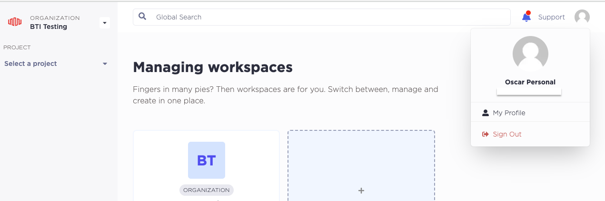
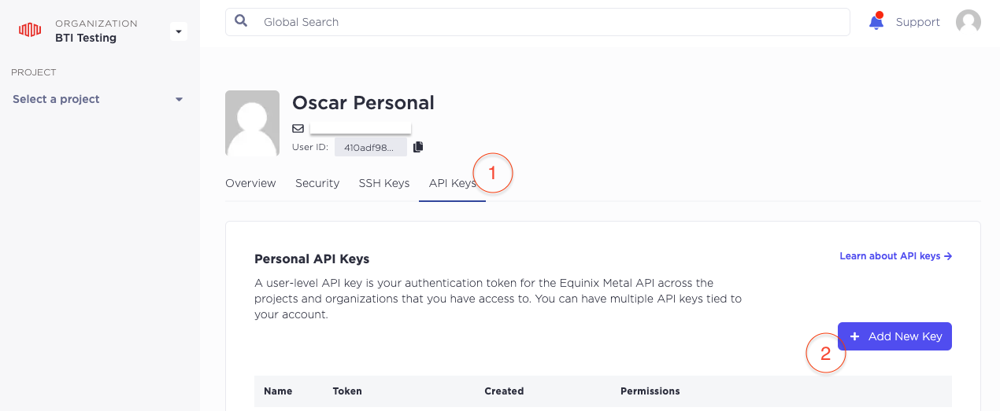
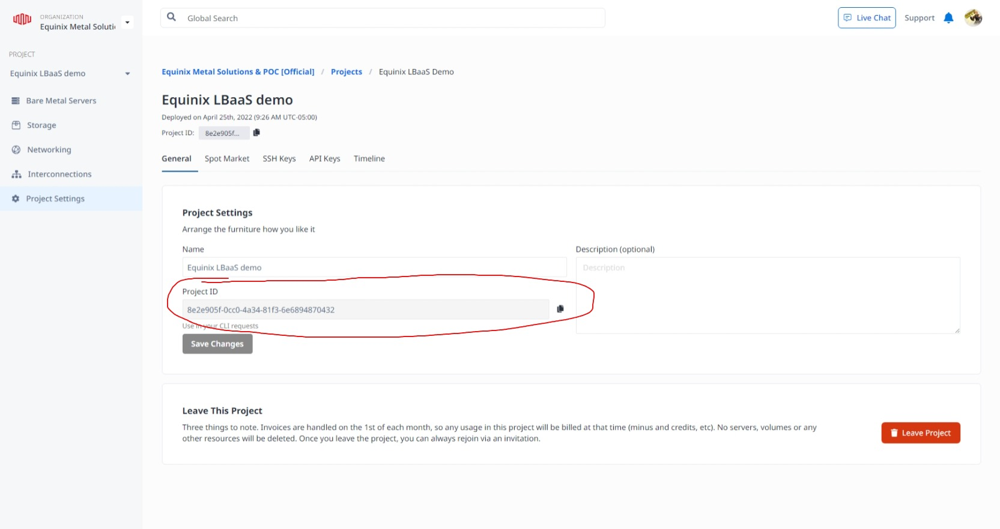

# Part 1: Account and API Key Setup

To run this workshop you will need access to an Equinix Metal Account or create a new one following step 1 below.

> **_Note:_** You are responsible for the cost of resources created in your Equinix Metal account while running this workshop.

## Pre-requisites

The following tools will be needed on your local development environment where you will be running most of the commands in this guide:

- A Unix-like environment (Linux, MacOS, [Windows WSL](https://docs.microsoft.com/en-us/windows/wsl/install))
- [docker](https://docs.docker.com/get-docker/)
- [kind](https://kind.sigs.k8s.io/docs/user/quick-start/)
- [helm](https://helm.sh/docs/intro/install/)
- [clusterctl](https://cluster-api.sigs.k8s.io/user/quick-start.html#install-clusterctl)
- [kubectl](https://kubernetes.io/docs/tasks/tools/install-kubectl/)

## Steps

### 1. Create an Equinix Metal account

If you have never used Equinix Metal before, don't worry, you just need 2 minutes to [sign-up and create your first organization](https://console.equinix.com/sign-up). If you have any doubt you can watch our [Getting Started with Equinix Metal](https://www.youtube.com/watch?v=5Ax6fKBeg2U&t=153s) video.

### 2. Create an API key

API keys in Metal can be tied to your user or to a single project. For this workshop we will need a user-level API key.

> **_Note:_** Project API keys do not have access to the entirety of the API; some endpoints can only be used by personal API keys.

To create a new user API key, access your user Profile in the Equinix Metal console, click on the **User Icon**, and click **My Profile**.

- Select the `API Keys` tab.
- Click on `+ Add New Key`.
- Create a new key with `Read/Write` permissions.

Copy the API key and save it in a safe place. You will need it later.

### 3. Get your Project ID

To get your project ID, click on the `Projects` tab in the Equinix Metal console. You will see a list of projects you have access to. Click on the project you want to use for this workshop. Click on the `Project Settings` tab and you will see the project ID.

Copy the project ID and save it in a safe place. You will need it later.

### 4. Create an SSH key

Follow the documentation for creating and adding an SSH key to your account [here](https://deploy.equinix.com/developers/docs/metal/identity-access-management/ssh-keys/).

We'll use this key to access the machines we create in the workshop and Cluster API will need it as part of its configuration.

Copy the _public_ SSH key and save it in a safe place. You will need it later.

## Discussion

Before proceeding to the next part let's take a few minutes to discuss what we did. Here are some questions to start the discussion.

- What is the purpose of an API key?
- What is the difference between a user and project API key?
- Why do we need to install these tools?
- What is the purpose of each tool?
