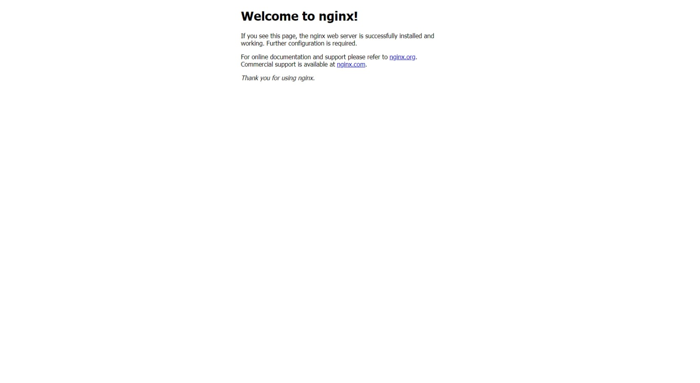
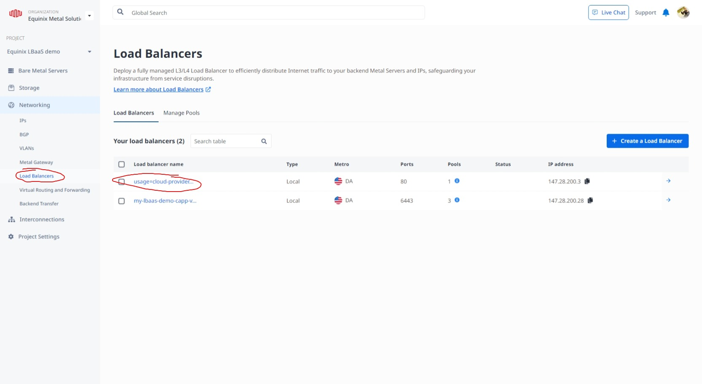
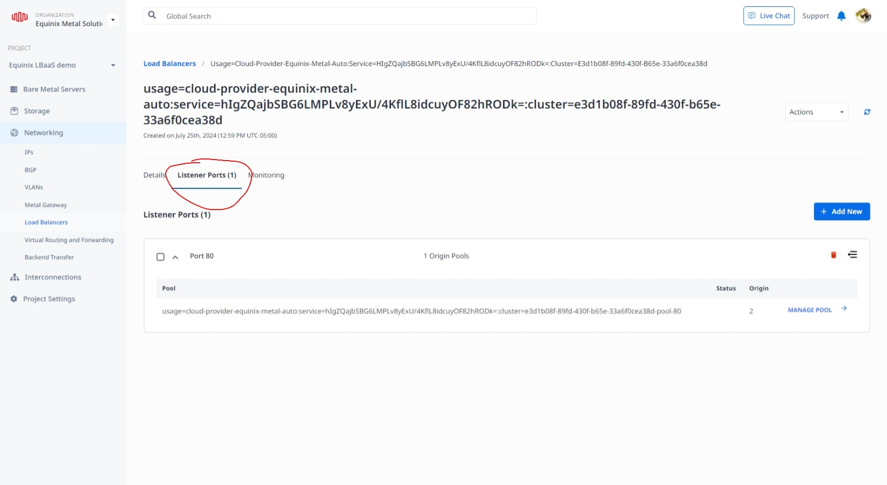
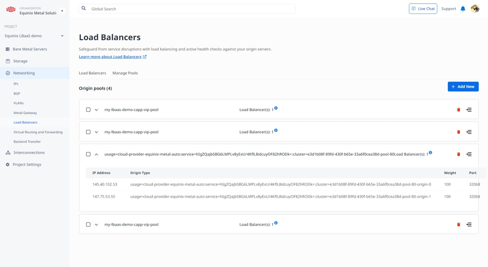

<!-- See https://squidfunk.github.io/mkdocs-material/reference/ -->

# Part 3: Deploy Application

## Steps

### 1. Configure CPEM

As part of creating our Kubernetes cluster in the last section, Cluster API Provider Packet installed Cloud Provider Equinix Metal for us. We will now configure it to set up service load balancers for us.

1. Delete current secret file

    ```shell
    kubectl delete secrets -n kube-system metal-cloud-config
    ```

1. Create a new secret file

    For example, create a file named `cloud-sa.json` with the following content:`

    ```text
    {
    "apiKey": "<YOUR_API_KEY>",
    "projectID": "<YOUR_PROJECT_ID>",
    "metro": "<YOUR_METRO>",
    "loadbalancer": "emlb:///<YOUR_METRO>"
    }
    ```

    It might look like the following for our example in the Dallas metro:

    ```shell
    > cat cloud-sa.json
    {
    "apiKey": "1234567890abcdefghijklmnopqrstuv",
    "projectID": "1234abcd-1234-abcd-ab12-abcdefgh1234",
    "metro": "da",
    "loadbalancer": "emlb:///da"
    }
    ```

1. Apply the new secret file

    ```shell
    kubectl create secret generic --from-file=./cloud-sa.json metal-cloud-config -n kube-system
    ```

1. Restart the cloud provider

    ```shell
    kubectl rollout restart ds -n kube-system cloud-provider-equinix-metal
    ```

1. Make sure Cloud Provider Equinix Metal has come back up, it should look like the below. If it doesn't say Running in the STATUS column, that could indicate a problem in your cloud-sa.json file you created earlier or that you forgot to `kubectl create` the secret using that file.

    ```shell
    kubectl get pods -n kube-system -l app=cloud-provider-equinix-metal
    NAME                                 READY   STATUS    RESTARTS   AGE
    cloud-provider-equinix-metal-6l7zh   1/1     Running   0          60s
    cloud-provider-equinix-metal-8dzpq   1/1     Running   0          62s
    cloud-provider-equinix-metal-dw89f   1/1     Running   0          63s
    ```

### 2. Deploy NGINX

1. Deploy a sample application

    Here we'll deploy a sample application to test the load balancer. We'll use the nginx deployment example from the Kubernetes documentation. This will set up a website that we can access through the load balancer.

    ```shell
    kubectl create namespace lbaas-demo
    kubectl apply -f https://k8s.io/examples/application/deployment.yaml -n lbaas-demo
    kubectl -n lbaas-demo -l app=nginx get pods
    ```

1. Expose the aplication

    ```shell
    kubectl expose --namespace lbaas-demo deployment nginx-deployment --type LoadBalancer --port 80
    ```

1. Wait for the load balancer to be created. This may take a few minutes.

    Keep running the following command and watch for the External IP address column to have a value and not say Pending...

    ```shell
    kubectl get svc nginx-deployment -n lbaas-demo
    NAME               TYPE           CLUSTER-IP      EXTERNAL-IP    PORT(S)        AGE
    nginx-deployment   LoadBalancer   172.26.58.144   <pending>      80:30486/TCP   19s
    ```

1. You should now be able to visit the IP address listed in the EXTERNAL_IP column in your browser and see the default nginx page.


1. Investigate the load balancer and its origin pool on the portal.

1. Go to the Equinix Metal portal and navigate to the project you are using.

1. Click on the Load Balancers tab. Your new load balancer should be listed and start with "usage=cloud-provider" it should look like below.


1. Click on that load balancer and go to "Listener Ports" and you should see the listener port that was created, like below.


1. Click on the "Manage Pool" and it'll take you to the origin pool for the Load Balancer, which should look similar to below:


## Discussion

Before proceeding to the next part let's take a few minutes to discuss what we did. Here are some questions to start the discussion.

- What is Cloud Provider Equinix Metal?
- What is the purpose of the cloud-sa.json file?
